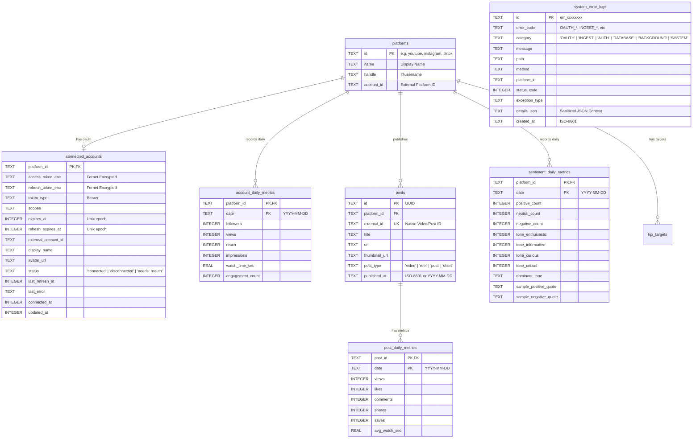
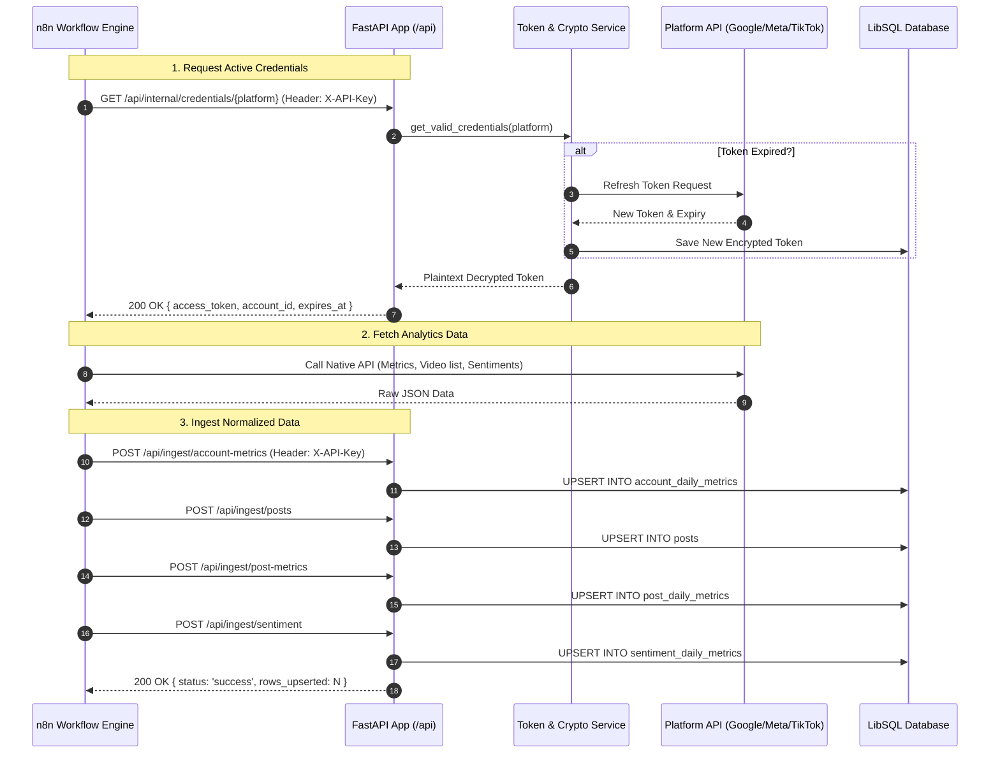

# Project Mapping & System Architecture Guide: IMPAKTA RADAR

> **Audience**: AI Coding Agents, Engineers, and Automated Tools.  
> **Purpose**: Single Source of Truth (SSOT) untuk memahami arsitektur, struktur direktori, data flow, model database, API contracts, dan konvensi kode dalam aplikasi **IMPAKTA RADAR** (`radar.impakta.my.id`).

---

## 1. Executive Summary & Tech Stack

Aplikasi ini adalah **IMPAKTA RADAR** (*Media & Publication Intelligence OS*) di bawah payung **IMPAKTA** (*Integrasi Manajemen Promosi dan Aksi Kehumasan Terpadu* - `impakta.my.id`). Sistem ini menyatukan dua pilar intelijen komunikasi digital:
1. **Analitik KPI Media Sosial Resmi**: YouTube, Instagram, dan TikTok (konsumsi via n8n webhook / ingest API, OAuth 2.0 multi-platform dengan enkripsi Fernet).
2. **Monitoring Publikasi Portal Kampus**: unmer.ac.id (kategori Berita ID `487` dan Artikel ID `919` via WordPress REST API `/wp-json` yang disimpan ke database Turso).

| Layer | Teknologi | Rincian / Catatan |
|---|---|---|
| **Runtime & Backend** | Python 3.12+ / FastAPI / Starlette | Asinkron murni (`async`/`await`), Uvicorn ASGI server |
| **Database** | LibSQL / Turso (`libsql-client-py`) | Driver HTTP/WebSocket/SQLite lokal (`file:local.db` atau cloud Turso) |
| **Frontend Foundation**| Pico CSS v2 (`@picocss/pico@2`) | Semantic HTML, zero-bloat, tanpa Tailwind CSS |
| **Custom Styling** | `app/static/css/custom.css` | Permanent Dark Mode (`#07090e`, `#0a0e17`), Glassmorphism, Responsive Drawer/Collapse |
| **Reactivity & DOM** | HTMX (`htmx.org@2.0.3`) + Alpine.js (`alpinejs@3.14.3`)| Micro-frontends/server-rendered partials, SPA-like tanpa framework JS berat |
| **Visualisasi Data** | Chart.js (`chart.js@4.4.6`) | Tren metrik interaktif, dark-themed charts |
| **Security & Crypto** | `cryptography.fernet` + SHA-256 + Pydantic v2 | Enkripsi token at-rest, masking log otomatis, CSRF OAuth validation |
| **Background Tasks** | APScheduler (`AsyncIOScheduler`) | Auto token refresh (interval 30m), auto-prune system error logs (interval 24h) |
| **Container & Infra** | Docker, Docker Compose, n8n | Multi-container compose (app + n8n automation engine) |

---

## 2. Directory Tree & File Inventory

```text
d:/kpi-sosmed/
├── .env.example                     # Blueprint konfigurasi environment
├── Dockerfile                       # Multi-stage image build Python 3.12
├── docker-compose.yml               # Service kpi_app + n8n orchestration
├── requirements.txt                 # Dependensi produksi
├── requirements-dev.txt             # Dependensi testing (pytest, respx, pytest-asyncio)
├── Makefile                         # Helper commands (dev, test, lint, migrations)
│
├── app/
│   ├── __init__.py
│   ├── config.py                    # Pydantic Settings (.env validator & singleton)
│   ├── db.py                        # Client wrapper LibSQL (execute, fetch_all, batch)
│   ├── main.py                      # FastAPI app instance, Lifespan, Scheduler, Middleware
│   ├── security.py                  # SensitiveDataFilter (log sanitizer), API key verifier, OAuth state
│   │
│   ├── models/
│   │   ├── __init__.py
│   │   └── schemas.py               # Pydantic v2 validation models (Ingest, Target, Credentials, Sentiment)
│   │
│   ├── oauth/                       # Modul Provider OAuth 2.0
│   │   ├── __init__.py              # Factory get_provider(platform)
│   │   ├── base.py                  # Abstract BaseOAuthProvider
│   │   ├── google.py                # YouTube Google OAuth2 (offline access, channel id)
│   │   ├── meta.py                  # Instagram Graph API OAuth2 (FB Login for Business, token exchange)
│   │   └── tiktok.py                # TikTok OAuth2 (client_key, PKCE / code exchange, token rotation)
│   │
│   ├── routes/
│   │   ├── auth.py                  # Session login, logout, require_auth dependency
│   │   ├── pages.py                 # Page controllers (/, /platform/{name}, /settings/*, /health)
│   │   ├── partials.py              # Endpoint HTMX fragments (/partials/kpi-cards, /partials/top-posts, dll.)
│   │   ├── oauth_routes.py          # OAuth redirect & callback (/connect/{platform}, /connect/{platform}/callback)
│   │   ├── ingest_api.py            # External Ingestion API (/api/ingest/*) terproteksi X-API-Key
│   │   ├── internal_api.py          # Internal Credential API (/api/internal/credentials/{platform}) untuk n8n
│   │   └── settings_targets.py      # CRUD KPI Targets (/settings/targets)
│   │
│   ├── services/
│   │   ├── crypto.py                # Fernet symmetric encryption / decryption token
│   │   ├── token_service.py         # Lifecycle token (save, refresh, lazy refresh, disconnect, async locks)
│   │   ├── ingest_service.py        # Logika database upsert payload dari n8n
│   │   ├── kpi_service.py           # Agregasi metrik, growth %, ER calculation, date formatting
│   │   ├── error_logger.py          # Structured error logging, DB audit trail, recursive masking
│   │   └── unmer_service.py         # Extractor & query WordPress REST API portal unmer.ac.id
│   │
│   ├── static/
│   │   ├── css/
│   │   │   └── custom.css           # Styling kustom (Pico overrides, dark theme, sidebar, charts)
│   │   └── js/
│   │       └── app.js               # Helper Chart.js interop & utility client
│   │
│   └── templates/                   # Jinja2 Semantic HTML Templates
│       ├── base.html                # Main master layout (Sidebar, Header, Alpine store)
│       ├── overview.html            # Dashboard agregat lintas platform
│       ├── platform_detail.html     # Detail per platform (YouTube, Instagram, TikTok)
│       ├── unmer_detail.html        # Monitoring portal berita & artikel unmer.ac.id
│       ├── connections.html         # Status koneksi OAuth & trigger manual sync
│       ├── select_instagram_account.html # Pilihan akun Instagram Business
│       ├── targets.html             # Manajemen target KPI
│       ├── logs.html                # System error log viewer & filter
│       ├── login.html               # Form login admin
│       │
│       └── partials/                # Fragmen responsif HTMX
│           ├── kpi_cards.html       # 5 KPI cards (Followers, Views/Impresi, Reach, ER, Post Count/Watch Time)
│           ├── trend_chart.html     # Render canvas Chart.js + state sync
│           ├── top_posts.html       # Tabel postingan performa terbaik
│           ├── sentiment_insight.html # Distribusi sentimen & analisis tone
│           ├── unmer_posts_table.html # Tabel monitoring berita & artikel unmer.ac.id
│           ├── unmer_sync_result.html # OOB Swap feedback sinkronisasi unmer.ac.id
│           ├── kpi_targets.html     # Target cards (hidden by default)
│           ├── sync_status.html     # Status trigger n8n sync
│           ├── connection_cards.html# Kartu status akun platform
│           └── error_logs_table.html# Tabel audit log error
│
├── migrations/
│   ├── runner.py                    # Asynchronous migration executor berbasis schema_migrations
│   ├── 001_initial.sql              # Core tables (platforms, accounts, metrics, posts)
│   ├── 002_sentiment_and_tone.sql   # Sentiment and Tone daily tables & indexes
│   ├── 003_system_error_logs.sql    # System error log tables & indexes
│   └── 004_unmer_posts.sql          # Portal unmer.ac.id posts monitoring table & indexes
│
├── n8n/
│   └── workflows/                   # Blueprint workflow automasi sync n8n
│       ├── youtube_sync.json        # Pipeline sync YouTube Analytics API
│       ├── instagram_sync.json      # Pipeline sync Meta Graph API
│       ├── tiktok_sync.json         # Pipeline sync TikTok Display API
│       └── error_alert.json         # Webhook notifikasi insiden error
│
├── scripts/
│   ├── generate_keys.py             # Generator SECRET_KEY & Fernet TOKEN_ENCRYPTION_KEY
│   └── seed_demo.py                 # Mock data seeder untuk dev/preview mode
│
└── tests/                           # Pytest test suite (100% coverage target for core flows)
    ├── conftest.py                  # In-memory SQLite fixture, mock settings, test client
    ├── test_crypto.py               # Enkripsi/dekripsi & masking unit test
    ├── test_token_service.py        # Token rotation & lazy refresh unit test
    ├── test_kpi_calculations.py     # Perhitungan metrik, format angka Indo, format tanggal DMY
    ├── test_oauth.py                # OAuth flow & CSRF state verification
    ├── test_ingest_api.py           # Ingestion endpoints & idempotency
    ├── test_internal_credentials.py # Validasi API Key & header internal
    └── test_error_logging.py        # Sanitasi data, auto-prune, correlation ID test
```

---

## 3. Database Architecture & Schema

Menggunakan LibSQL SQLite engine. Semua tanggal metrik harian menggunakan format ISO-8601 string (`YYYY-MM-DD`). Semua timestamps menggunakan Unix timestamp integer (`INTEGER`).



---

## 4. Ingestion & Credential Flow (n8n Integration)

Aplikasi bertindak sebagai **Credential Authority** dan **Central Data Store**. n8n bertindak sebagai **Scheduler & ETL Engine**.



---

## 5. UI Architecture & Responsive Interaction

### Layout & Framework Strategy
- **Framework**: Pico CSS v2 sebagai semantic baseline (`<main>`, `<header>`, `<article>`, `<table>`).
- **Overrides**: `app/static/css/custom.css` mengatur layout grid, dashboard card, font variables, dan animasi.
- **Theme**: Permanent Dark Mode (`#07090e` root background, `#0a0e17` sidebar, `#0f172a` cards).
- **Icons**: 100% Vector SVG murni inline (bebas emoji).

### Sidebar & Responsive Toggle State
- Dikelola oleh **Alpine.js** pada `<body>` di [`app/templates/base.html`](file:///d:/kpi-sosmed/app/templates/base.html):
  ```javascript
  {
      mobileSidebarOpen: false,
      desktopCollapsed: localStorage.getItem('sidebar_collapsed') === 'true',
      toggleSidebar() {
          if (window.innerWidth <= 768) {
              this.mobileSidebarOpen = !this.mobileSidebarOpen;
          } else {
              this.desktopCollapsed = !this.desktopCollapsed;
              localStorage.setItem('sidebar_collapsed', this.desktopCollapsed);
          }
      }
  }
  ```
- **Desktop (> 768px)**:
  - Default: Sidebar selebar `260px` terpasang di sisi kiri.
  - Collapse: Class `.sidebar-collapsed` pada container menggeser sidebar `transform: translateX(-100%)` dan menyetel `.dashboard-main { margin-left: 0 }`. State tersimpan di `localStorage`.
- **Mobile (<= 768px)**:
  - Default: Sidebar tersembunyi off-canvas.
  - Toggle: Membuka drawer dengan class `.open` dan memunculkan `.mobile-backdrop` semi-transparan.

### HTMX Reactive Partials
Filter tanggal (`7d`, `30d`, `90d`, `custom`) dan tab navigasi memicu HTMX get tanpa me-reload seluruh halaman:
- `hx-get="/partials/kpi-cards?range=..."` -> target `#kpi-cards-container`
- `hx-get="/partials/trend-chart?range=..."` -> target `#trend-chart-container`
- `hx-get="/partials/top-posts?range=..."` -> target `#top-posts-container`
- `hx-get="/partials/sentiment-insight?range=..."` -> target `#sentiment-insight-container`

---

## 6. Core Business Logics & Formulas

Semua kalkulasi sentral berada di [`app/services/kpi_service.py`](file:///d:/kpi-sosmed/app/services/kpi_service.py):

### 1. Engagement Rate (ER)
$$\text{ER} = \frac{\text{Total Likes} + \text{Total Tags/Saves} + \text{Total Shares}}{\max(1, \text{Total Views})} \times 100\%$$
- **Views**: Akumulasi views konten pada periode terpilih.
- **Interaksi**: Komponen mencakup Likes, Komentar, Tag/Saves, dan Share.

### 2. Pertumbuhan Metrik (Growth %)
$$\Delta\% = \frac{\text{Nilai Akhir} - \text{Nilai Awal}}{\max(1, \text{Nilai Awal})} \times 100\%$$

### 3. Net Sentiment Score (NSS)
$$\text{NSS} = \frac{\text{Positif} - \text{Negatif}}{\max(1, \text{Positif} + \text{Netral} + \text{Negatif})} \times 100$$
- Rentang: $-100$ hingga $+100$.
- Kategori:
  - $\ge +25$: **Sangat Positif** (Hijau emerald)
  - $\ge +5$: **Cenderung Positif** (Hijau mint)
  - $> -5$ s/d $< +5$: **Netral / Berimbang** (Abu-abu slate)
  - $\le -25$: **Kritikal / Negatif** (Merah rose)

### 4. Format Angka & Tanggal
- **Format Angka Indonesia**: `format_number_id(val)` -> `1,2 jt`, `45,8 rb`, `1,5 M`.
- **Format Tanggal Standar**: `format_date_dmy(val)` -> Selalu berformat **`DD/MM/YYYY`** (contoh: `25/10/2026`).

---

## 7. Security & Error Handling Guidelines

1. **Token At-Rest Encryption**:
   - Seluruh token OAuth (`access_token`, `refresh_token`) **wajib** dienkripsi sebelum disimpan ke database menggunakan `encrypt_token(raw_token)` dari [`app/services/crypto.py`](file:///d:/kpi-sosmed/app/services/crypto.py).
   - Dekripsi hanya dilakukan *on-the-fly* via `decrypt_token(cipher_token)` saat dibutuhkan oleh API internal.

2. **Sensitive Log Sanitization**:
   - Logging handler terpasang filter `SensitiveDataFilter` di [`app/security.py`](file:///d:/kpi-sosmed/app/security.py).
   - Seluruh key regex: `token|secret|password|key|authorization|bearer|cookie|access_token|refresh_token|api_key` secara otomatis disamarkan (`[REDACTED]`).
   - Setiap error audit trail masuk ke tabel `system_error_logs` dengan `sanitize_data()` rekursif.

3. **Error Logging Standardized Schema**:
   - Menggunakan `log_system_error()` dari [`app/services/error_logger.py`](file:///d:/kpi-sosmed/app/services/error_logger.py).
   - Kategori standar: `ErrorCategory.OAUTH`, `INGEST`, `AUTH`, `DATABASE`, `BACKGROUND`, `SYSTEM`.
   - Correlation ID: Menggunakan header `X-Correlation-ID` atau digenerate otomatis `err_<uuid>`.
   - UI viewer tersedia di `/settings/logs`.

4. **Zero Emoji Constraint**:
   - Seluruh komponen UI, badge, teks label, template Jinja, dan kode backend **tidak boleh menggunakan icon emoji**.
   - Gunakan selalu SVG inline dengan stroke/fill bersih.

---

## 8. Development & Testing Commands

Semua perintah dijalankan di dalam container Docker `kpi_app` atau virtual environment:

```bash
# 1. Menjalankan container
docker compose up -d

# 2. Menjalankan seluruh test suite (27 tests)
docker exec kpi_app pytest -v

# 3. Menjalankan migrasi database
docker exec kpi_app python -m migrations.runner

# 4. Generate token encryption key baru
docker exec kpi_app python scripts/generate_keys.py

# 5. Seed data dummy untuk preview visual
docker exec kpi_app python scripts/seed_demo.py

# 6. Cek health status endpoint
curl http://127.0.0.1:8000/health
```

---

## 9. Quick Guide for AI Agents Making Changes

Saat agen AI lain menerima instruksi untuk memodifikasi proyek ini:

1. **Menambah/Mengubah Halaman**:
   - Daftarkan route di [`app/routes/pages.py`](file:///d:/kpi-sosmed/app/routes/pages.py).
   - Buat template di `app/templates/<nama>.html` dan selalu extend `base.html`.
   - Jika butuh partial reload, buat fragmen di `app/templates/partials/` dan endpoint di [`app/routes/partials.py`](file:///d:/kpi-sosmed/app/routes/partials.py).

2. **Menambah Field Metrik Baru**:
   - Buat file migrasi SQL baru di `migrations/` (misal: `004_add_new_metric.sql`).
   - Update model Pydantic di [`app/models/schemas.py`](file:///d:/kpi-sosmed/app/models/schemas.py).
   - Update fungsi upsert di [`app/services/ingest_service.py`](file:///d:/kpi-sosmed/app/services/ingest_service.py).
   - Update agregasi di [`app/services/kpi_service.py`](file:///d:/kpi-sosmed/app/services/kpi_service.py).

3. **Aturan Styling & CSS**:
   - **JANGAN tambahkan Tailwind CSS**. Seluruh tampilan bersandar pada Pico CSS v2 + `app/static/css/custom.css`.
   - Pastikan warna tetap mengikuti palet tema gelap (`#07090e`, `#0a0e17`, `#0f172a`, `#1e293b`, `#3b82f6`).

4. **Verifikasi**:
   - Selalu jalankan `docker exec kpi_app pytest -v` setelah melakukan perubahan kode backend untuk memastikan tidak ada regresi pada flow autentikasi, enkripsi, dan kalkulasi KPI.
